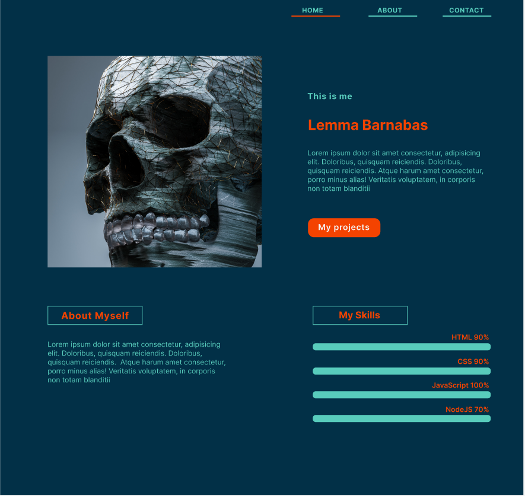

# Website UX/UI Design

> In this project, a UX/UI design of a personal portfolio website is created
> based on needs of the stakeholder (website owner)

## Table of contents

- [Website UX/UI Design](#website-uxui-design)
  - [Table of contents](#table-of-contents)
  - [General info](#general-info)
  - [Screenshots](#screenshots)
  - [Technologies](#technologies)
  - [Setup](#setup)
  - [Features](#features)
  - [Status](#status)
  - [Inspiration](#inspiration)
  - [Contact](#contact)

## General info

> At present time, design had become a fundamental part of every project. This
> is because it is during design that important considerations regarding the
> final users of a product are made. In essence it is important that the final
> users has the best experience when using a product/service such as a website.
> For this project, the goal was to design a personal portfolio website that can
> be later implemented by the stakeholder to meet his needs

## Screenshots

## Technologies

- Node 14.16.0
- VSC code
- Figma

## Setup

- `fork` partners repo
- `clone` forked repo to the local dev environment
- `npm run start`

## Features

The website design features three pages

- Homepage

- Projects page

- Contact page

## Status

Project is: _complete_

## Inspiration

Website design is inspired by the _terminal_

## Contact

Design By [Brian Munene](https://github.com/BrianMunene96)
